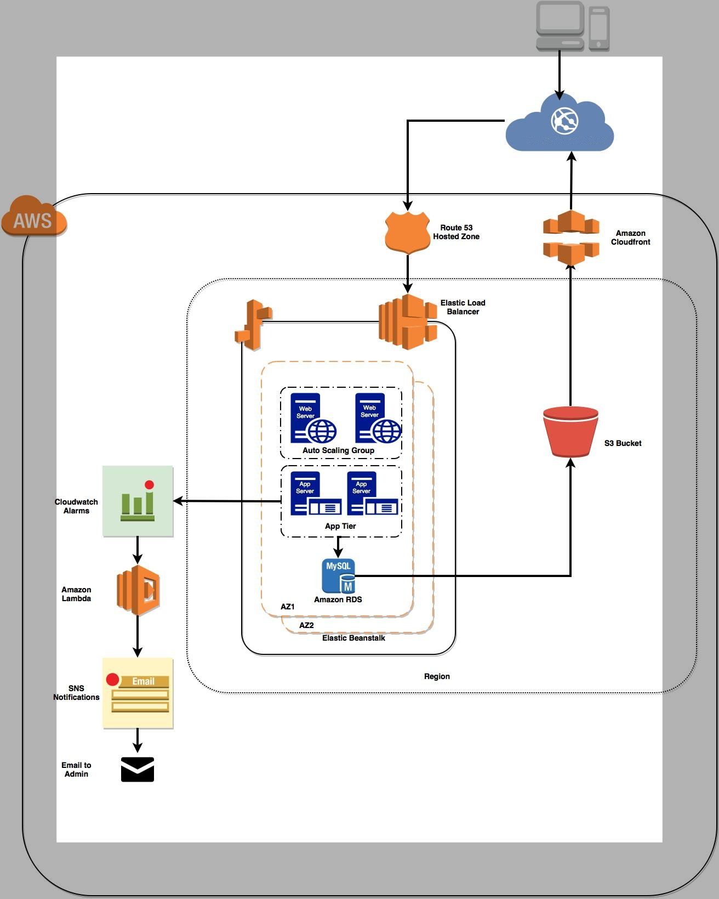

# **Simplified Drive**

---

## 📌 **Introduction**

**University:** [Northeastern University](https://www.northeastern.edu/)  
**Course:** Fundamentals of Cloud Computing  - CS6620
**Professor:** Prof. Genao Domingo  
**Developer:** Aditya Bhanwadiya  

---

## 🌟 **Project Overview**

**Simplified Drive** is a full-stack web application designed for seamless cloud storage. This application enables users to securely **upload, retrieve, delete, and update** files by leveraging **Amazon S3**.

🔹 **Key Features:**
- Secure file storage with Amazon S3.
- Full **CRUD** operations (Create, Read, Update, Delete).
- Optimized performance and scalability.
- Private accounts for individual users.
- Cross-device compatibility (Desktop & Mobile).

---

## 📂 **Application Features**

✅ **User Authentication:**
- **Sign-Up**: New users can register and store credentials securely.
- **Login**: Existing users can access their accounts with secure authentication.

✅ **File Management:**
- **Upload Files**: Easily store documents, images, or any data.
- **Retrieve Files**: Access previously uploaded files.
- **Update Files**: Modify existing files by re-uploading updates.
- **Delete Files**: Remove files when they are no longer needed.

✅ **User Dashboard:**
- View uploaded files along with metadata:
  - **File Name**
  - **Upload Timestamp**
  - **Last Updated Timestamp**
  - **User Information**

✅ **Resources & External Links:**
- Quick access to cloud-related documentation and best practices.
- Easy navigation to **social media and cloud services**.

---

## 🏗 **Architecture Diagram**

---

## ⚙ **Prerequisites**

To set up and run this project, you need:

🔹 **AWS Account:**
- Create an **Amazon AWS** account.
- Set up an **S3 Bucket** for file storage.
- Configure **CloudFront** for caching and performance.
- Deploy on **Elastic Beanstalk** for scaling.
- Use **Amazon RDS (MySQL)** for database storage.
- Set up **CloudWatch Alarms** for monitoring.
- Enable **AWS Lambda** for event notifications.

🔹 **Software & Tools:**
- Install **Node.js** ([Download Here](https://nodejs.org/en/))
- Code Editor: **VS Code / Sublime Text / Notepad++**
- AWS CLI for cloud management.

---

## 🛠 **Tech Stack**

### **Frontend:**
🎨 **AngularJS + Materialize** – Ensures a smooth UI/UX.

### **Backend:**
🚀 **Node.js + Express.js** – Handles server-side logic efficiently.

### **Database:**
🗄 **Amazon RDS (MySQL)** – Manages user and file data.

### **Cloud Services:**
☁ **AWS Infrastructure (S3, EC2, CloudFront, Elastic Beanstalk, RDS, CloudWatch, Lambda)**

---